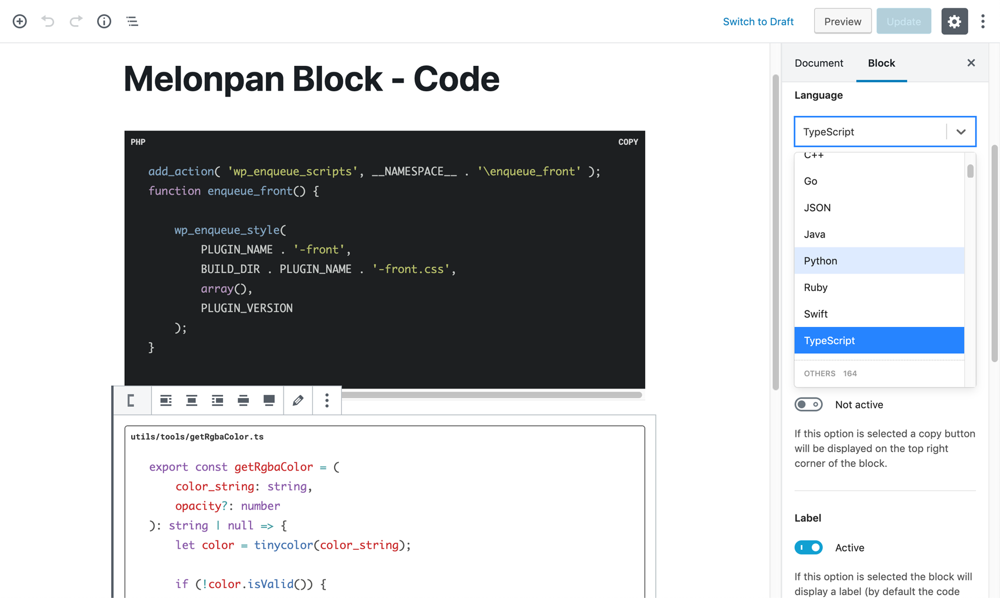

# Melonpan Block - Code

Block to display code, with highlighted syntax, which can be copied to the clipboard.

## Features

The block comes with the following settings:

- **Code language**: JavaScript, CSS, PHP, etc. [Full list of languages](https://prismjs.com/#languages-list).
- **Color theme**
- **Label**: Top left label that can be customized. By default the code language.
- **Copy button**: Top right button to copy the block content.
- **Padding**
- **Border width** and **Border radius**

 

 

---

This plugin can be downloaded from the [WordPress repository](https://wordpress.org/plugins/melonpan-block-code/).
